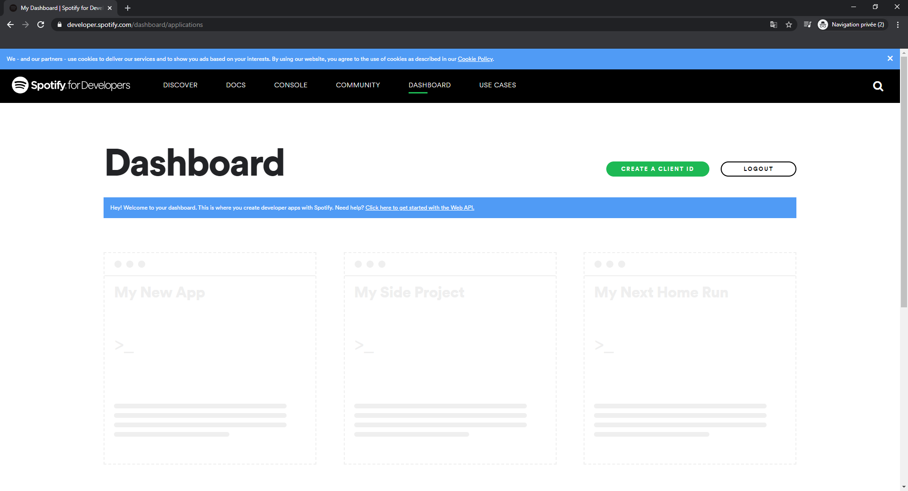
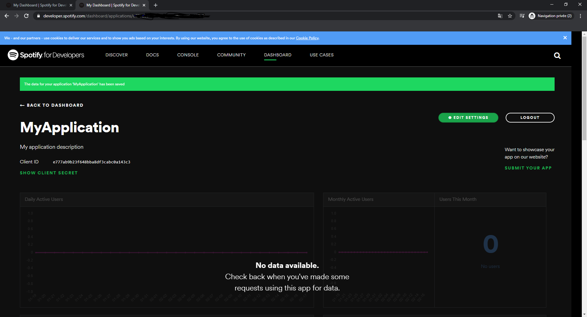

# Tutoriel React / React Native
*Par Fabien Cellard et Maëva Trivino*

*Tutoriel de présentation de React et React Native à travers une API Spotify*

## I. :newspaper: Histoire de React / React Native et but du tutoriel

React est une libraire Javascript dévelopée et lancée par Facebook en 2011 pour répondre aux besoins de ces applications. React permet de créer des interfaces utilisateurs réactives à l'aide de vues et de composants qui vont venir s'adapter aux changements des données de l'application.

React Native est une extension de React développée en 2015 par Facebook qui reprend les principes de React et les applique à la création d'applications natives Android ou iOs en utilisant du code javascript. 

Dans ce tutoriel, nous allons vous montrer différents concepts de React et React Native pour créer une application nous permettant d'interagir avec l'API de Spotify.

## II. :wrench: Outils nécéssaires

Dans ce tutoriel, réalisé sous Windows, nous allons avoir besoin de NodeJS, un environnement de développement, par exemple Visual Studio Code, qui est gratuit, et expo. Ce dernier s'installe grâce à npm, installé depuis NodeJS.

## III. :factory: Installation des outils

Pour installer Visual Studio Code, télécharger l'environnement de développement ici : https://code.visualstudio.com/Download .

Pour installer NodeJS, vous pouvez le faire ici : https://nodejs.org/en/ (version LTS recommandée).

Une fois que ces outils sont installés, se rendre dans un terminal de commande ou powershell et lancer la commande suivante : 

> `npm install -g expo-cli`

Maintenant, vous avez donc expo et vous êtes en mesure de créer votre premier projet React / React Native. Pour créer ce projet, rendez-vous au dossier dans le terminal où vous souhaitez stocker ce projet (avec la commande `cd dossier`) et lancer la commande suivante : 
> `expo init projectName`

Choississez un projet `blank` (les flèches directionnelles pour changer de mode et *entrée* pour valider votre choix). Ce rendre ensuite dans le dossier du projet avec *cd projectName* puis lancer les commandes suivantes : 
> `npm install`  
`npm start`

Un onglet internet va s'ouvrir avec les logs de l'application. 

### :computer: **Web**

Une fois expo complètement lancé, tapez `W` dans la console, cela aura pour effet de lancer la compilation de votre projet en web. Votre projet est maintenant accessible à l'adresse : 

> `http://localhost:19006/`

:warning: Veillez bien au port sur lequel votre site est lancé car cela va nous être utile pour la suite.

### 📱 **IOs & Android**

Si vous possédez un émulateur sur votre machine vous pouvez juste appuyer sur `Run on Android device/emulator` ou `Run on IOs simulator` qui lancera votre application sur votre émulateur. 

Si votre téléphone Android est sur le même réseau que votre machine de développement, vous pouvez télécharger l'application [Expo](https://play.google.com/store/apps/details?id=host.exp.exponent), et flasher le QR code pour lancer l'application sur votre appareil. 

Si votre téléphone est relié en USB à votre machine de développement (*veillez à débloquer le débogage USB dans les paramètres développeur de l'appareil comme indiqué [ici](https://www.frandroid.com/comment-faire/tutoriaux/229753_questcequelemodedebogageusb*)*) cliquez sur `local` au dessus du QR Code et `Run on Android device/emulator` pour lancer l'application sur votre téléphone (:warning: Vous aurez peut être à télécharger l'application Expo au premier lancement).

## IV. 🌳 Arborescence du projet 

En ce rendant dans votre environnement de développement, vous allez pouvoir observer l'arborescence du projet.

On peut constater qu'aucun dossier de sources est créé. Nous vous recommandons dès à présent de créer un dossier ***src*** pour stocker vos scripts. Ceux-ci seront en javascript.

Le fichier ***package.json*** stocke toutes les dépendances du projet ainsi que leur version. En effet, il est possible d'utiliser npm pour installer des dépendances utiles au projet (des éléments pour le front-end, des API, etc). Utilisez la commande pour installer le paquet fourni par le développeur dans le dossier du projet à l'aide d'un terminal de commande. Sa référence sera automatiquement ajouté au fichier *package.json*. Les dépendances seront téléchargées dans le dossier ***nodes-modules*** du projet. Bien évidement, si vous souhaitez partager votre projet, il est inutile de le partager sur votre repo car ilest très volumineux. Partagez uniquement le fichier *package.json*. Le nouvel utilisateur du projet aura simplement a appliquer la commande `npm install` dans le dossier du projet pour installer toutes les dépendances. Si vous n'avez pas de .gitignore et que vous utilisez git, pensez à en ajouter un adapté pour Node. Cela vous évitera de mettre des éléments trop volumineux et téléchargeable en local sur votre dépôt.

Le fichier ***App.js*** est le point d'entrée de l'application. C'est la première vue de l'application. Ce sera donc ici qu'on l'on aura à initer nos outils.

## V. :lipstick: Mise en place du Front-end

Dans le dossier ***src*** créé précédement, nous allons créé un dossier ***components*** pour stocker nos vues. L'idée est de faire un fichier par écran.

### V.I. :house: La vue d'accueil

La vue d'accueil va contenir un message et un bouton pour se connecter à l'API Spotify. Nous allons donc créer dans le dossier ***components***, un fichier javascript intitulé ***loginScreen.js***.

Pour avoir la possibilité d'afficher une vue, il faut définir une classe étendue à un composant React : 

```js
import React, { Component } from 'react';

export default class LoginScreen extends Component
{
    constructor(props) {
        super(props);
    }

    render() {
        return(
           //Code de la vue
        )
    }
}
```

Cette classe possède deux parties importantes : 
- Le constructeur de la classe via la méthode ***constructor(props)***.
- La méthode ***render()*** va permettre d'effectuer des méthodes, puis, dans le return, retourner la vue du composant.

On va donc pouvoir ajouter un bouton et du texte dans cette vue : 
```js
render() {
	return(
		<View>
        	<View>
            	<Text>Tutorial React / React Native</Text>
            </View>
            <View>
            	<Button
    	        	onPress={LoginScreen._LoginToAPI()}
                	title="Connect to Spotify"
                	color="#20D760"
       	    	/>
 	        </View>
        </View>
	)
}
```

Les éléments de la vue sont représentés comme des balises HTML. Il est important de concaténer les éléments de la vue dans un container ***View***, un équivalent du container ***div*** en développement HTML. Il existe différents types de vues mais dans notre cas, nous allons juste utiliser des vues simples. De même, pour appliquer des styles aux éléments, il faut bien séparer les éléments dans des containers différents si vous souhaitez avoir des comportements différents.

Pour créer un affichage de texte, on utilise la balise ***Text***. Entre les 2 balises, il suffit simplement de placer le texte choisi.

Pour créer un bouton, on utilise la balise ***Button***. Celui-ci possède 3 paramètres importants : 
- ***onPress*** permet d'effectuer une action quand le bouton est pressé.
- ***title*** permet d'afficher du texte dans le bouton.
- ***color*** permet d'appliquer une couleur au bouton.

Il est nécessaire de créer une fonction *_LoginToAPI()*, vide dans un premier temps, pour prévoir le comportement du bouton (le paramètre *onPress* est requis pour le bouton). Dans le composant, ajoutez : 

```js
static _LoginToAPI()
{
        
}
```

Pour appliquer du style sur des éléments, on utilise le paramètre ***style*** dans les balises. On pourrait simplement écrire le style dans la balise mais pour plus de propreté, nous allons créer une constante de style et appliquer ses éléments à nos balises. Pour appliquer du style, cela fonctionne sous la même logique que du css, certains paramètres et leur utilisation peuvent être légèrement différent mais ressemble en grande partie. Placez cette constante en dehors du composant : 

```css
const styles = StyleSheet.create({
    container: {
        flex: 1,
        justifyContent: 'center',
    },
    buttonContainer: {
        marginLeft: 50,
        marginRight: 50,
        marginTop: 20,
        marginBottom: 20
    },
    titleContainer: {
        margin: 5,
        alignItems: 'center'
    },
    titleStyle: {
        fontSize: 30
    }

});
```

Maintenant, on modifie la vue en ajoutant ces éléments de style : 
```js
render() {
	return(
    	<View style={styles.container}>
        	<View style={styles.titleContainer}>
            	<Text style={styles.titleStyle}>Tutorial React / React Native</Text>
            </View>
            <View style={styles.buttonContainer}>
           		<Button
        	        onPress={LoginScreen._LoginToAPI()}
                    title="Connect to Spotify"
                    color="#20D760"
                />
            </View>
        </View>
	)
}
```

Pour lancer l'affichage de cette vue à l'extérieur du composant, il faut créer une méthode statique dans le composant pour le construire. Pour cela, il suffit simplement de l'appeler avec une balise. Le nom de celle-ci est celle du composant, dans notre cas ***LoginScreen*** : 

```js
static loginScreenView () {
	return(
    	<LoginScreen/>
    );
}
```

Cette méthode statique, du moment qu'elle est définie dans le composant, pourra être appelé dans un autre composant.

### V.II. :factory: La vue principale

Une fois connecté à l'API Spotify, il faudra avoir une vue principale. Vous pouvez donc créer un nouveau fichier dans le dossier *components* intitulé ***mainScreen.js***.

Vous pouvez définir un composant tel que le menu d'accueil avec un texte et un bouton de déconnexion. Vous pouvez aussi définir votre style et pensez à créer une méthode statique dans le composant intulé ***mainScreenView*** pour avoir construire cette vue dans un autre composant.

### V.III. :boat: Naviguer entre les écrans

#### V.III.I. ⚙️ Définir le système de navigation

Pour naviguer entre les écrans, nous allons utiliser ***React Navigation***. Pour l'installer, ouvrez le terminal de commande à la racine du projet et appliquez ces commandes : 

> `npm install @react-navigation/native`

> `expo install react-native-gesture-handler react-native-reanimated react-native-screens react-native-safe-area-context @react-native-community/masked-view`. 

Ces dépendances permettent d'utiliser un système de navigation entre les écrans.

Notre premier système de navigation va être intégrer dans le fichier ***App.js*** à la racine du projet : 

```js
import 'react-native-gesture-handler';

import React from 'react';
import { NavigationContainer } from '@react-navigation/native';
import loginScreen from "./src/components/loginScreen";
import mainScreen from "./src/components/mainScreen";
import {navigationRef} from "./src/navigation/navigatorRef";
import {createStackNavigator} from "@react-navigation/stack";

const Stack = createStackNavigator();

function LoginScreen() {
    return (
        loginScreen.loginScreenView()
    );
}

function MainScreen() {
    return (
        mainScreen.mainScreenView()
    );
}

function App() {
  return (
      <NavigationContainer ref={navigationRef}>
        <Stack.Navigator headerMode="none">
          <Stack.Screen name="Login" component={LoginScreen}/>
          <Stack.Screen name="Home" component={MainScreen} />
        </Stack.Navigator>
      </NavigationContainer>
  );
}

export default App;
```

Le premier import est essentiel pour utiliser React Navigation. Ensuite, il faut définir une constante ***stackNavigator***. Dans la fonction ***App()***, on défini ce navigateur. Tout d'abord, on applique un container pour notre navigateur. Ensuite, dans le stack que l'on a défini, on répertorie les écrans avec lequel on veut naviguer. On donne un nom et on spécifie une méthode qui devra renvoyer une vue. On va donc définir des fonctions qui retournent les fonctions statiques que l'on a défini dans les composants.

#### V.III.II. :arrows_counterclockwise: Changer d'écran dans un autre composant

Il est possible de changer de composant dans un autre écran si l'on a la référence du navigateur (la référence est déjà placé sur le container dans *App.js*). Il suffit de placer une référence sur le container de navigation. Cette référence va pointer sur un fichier javascript dans un dossier ***navigation*** dans le dossier *src* intitulé ***navigatorRef.js*** : 

```js
import { StackActions } from '@react-navigation/routers';

export const navigationRef = React.createRef();

export function navigate(name, params) {
    navigationRef.current?.navigate(name, params);
}

export function replace(name, params){
    const pushAction = StackActions.replace(name, params);

    navigationRef.current?.dispatch(pushAction);
}
```

Définir ces fonctions permet d'utiliser les fonctions de navigation de notre navigateur dans n'importe quel composant : 
- La méthode ***navigate*** permet de changer d'écran avec la possibilité de retourner à l'écran précédant.
- La méthode ***replace*** permet de ne pas pouvoir retourner à l'écran précédant.

Dans le cas d'une connexion à un compte, il est intéressant de bloquer le retour à l'écran précédant.
 
Il faut impérativement préciser le ***export*** dans la définition de la fonction pour qu'elle soit utilisable dans n'importe quel composant.

Pour utiliser cette référence, nous allons placer une redirection au moment où l'on appuie sur le bouton de redirection. Dans un premier temps, précisez cet import dans le fichier ***loginScreen.js*** : 

```js
import * as NavigatorRef from '../navigation/navigatorRef'
```

On peut donc assez facilement, dans la méthode *_LoginToAPI*, utiliser la méthode *replace* de la référence : 

```js
NavigatorRef.replace('Home');
```

En appuyant sur le bouton de connexion, vous allez être capable de naviguer à votre écran d'accueil.

### V.IV. 🔨 Création d'onglets à la vue principale

Vous allez, pour commencer, créez un dossier ***tabs*** dans le dossier ***components***, pour stocker les écrans des onglets.

#### V.IV.I. 📌 Onglet principal

Pour cet onglet principal, créez un fichier dans le dossier *tabs* intitulé *homeTab.js*. Implémentez un composant *HomeTab* sous les exemples des composants créés précedement. Vous pouvez reprendre la vue créée dans *mainScreen* et supprimer sa vue (et non son composant), puisque nous placerons un nouveau navigateur dans cette dernière.

#### V.IV.II. 📝 Onglet Playlists

Pour afficher les playlists, implémentez un composant avec une vue vide intitulé ***playlistTab.js*** dans le dossier ***tab***. Pour afficher les playlists nous allons utiliser une ***ScrollView*** et des cartes dans ***React Native Elements***. Pour installer cette dépendance, dans une terminal de commandes à la racine du projet, faites la commande suivante :

> `npm install react-native-elements`

Pour tester l'affichage de nos cartes (puisque nous n'avons encore pas de connexion à l'API), nous allons créer une constante à l'extérieur du composant pour répertorier les différentes playlists : 

```js
const playlists = [
    {
        name : 'Toad Party !',
        imageUrl : 'https://vignette.wikia.nocookie.net/mario/images/3/38/CTTTChampignonD%27invincibilit%C3%A9.png/revision/latest?cb=20170322153140&path-prefix=fr'
    },
    {
        name : 'Mario Party !',
        imageUrl: 'https://upload.wikimedia.org/wikipedia/en/a/a9/MarioNSMBUDeluxe.png'
    }
];
```

On va donc pouvoir établir la vue en fonction de cette liste : 

```js
render() {
	return(
 	   <ScrollView style={stylePlaylist.container}>
       {
	       playlists.map((playlist, i) =>{
         	  return(
      	        <Card key={i}>
     	           <View style={stylePlaylist.cardContainer}>
         	          <View>
              	      	<Image
               	        	style={stylePlaylist.imageStyle}
                           resizeMode="cover"
                           source={{ uri: playlist.imageUrl }}
                       />
                       </View>
                       <View style={stylePlaylist.infoPlaylistContainer}>
    	                   <Text>{playlist.name}</Text>
                       </View>
                   </View>
                </Card>
               );
           })
    	}
        </ScrollView>
    )
}
```

Dans le *ScrollView*, on effectue un ***map*** sur la variable *playlists* pour créer une carte pour chaque éléments de la liste. Chaque élément va pouvoir être récupéré ainsi qu'une clé unique pour l'identifier facilement. On applique cette clé à chaque carte. On implémente ensuite une image et le titre de la playlist. 

Le style est à votre discrétion pour la suite du tutoriel, le code source fourni peut vous donner un exemple d'implémentation.

#### V.IV.III. 🔍 Onglets Recherche

Cette fois, nous allons créer un dernier onglet de recherche de chansons, intitulé ***searchTab.js*** dans le le dossier *tabs*. La aussi, implémentez un composant avec un render vide.

La différence avec la vue précédente, c'est d'ajouter un ***TextInput*** comme barre de recherche et de changer quelque peu la liste de retour de la recherche. Nous allons aussi placer un bouton pour lancer la recherche, pour plus de facilité de traitement, à placer hors de la  ***ScrollView*** par vos soins.

Pour ajouter un ***TextInput***, nous avons besoin d'utiliser la variable ***state*** du composant React, qui permet d'être stockée et d'être modifiée en temps réel, pendant que la vue est affichée. Le constructeur du composant sera donc implémenté de la sorte : 

```js
constructor(props) {
	super(props);
   	this.state = {
  	  textSearch: ""
    }
}
```

Dans la vue, avant le *ScrollView*, nousa allons ajouter le *TextInput* : 

```js
<View style={styleSearch.textInputContainer}>
	<TextInput
 		style={styleSearch.textInput}
		placeholder="Search a song !"
        onChangeText={(textSearch) => this.setState({textSearch})}
        value={this.state.textSearch}
        onSubmitEditing={}
	/>
</View>
```

Ici, lorsque l'input est modifié, on adapte la variable *state* pour stocker le résultat en temps réel.

La propriété ***onSubmitEditing*** va nous permettre de définir un comportement quand l'utilisateur appuyera sur la touche entrée de son clavier. 

Pour implémenter les cartes, inspirez vous du code de l'onglet précédent tous en prenant soin de s'adapter à ce type de résultat : 

```js
const result = [
    {
        name: 'GoGoToad',
        mainArtist : 'Toad',
        albumName: 'Toad Dance',
        imageUrl : 'https://vignette.wikia.nocookie.net/mario/images/3/38/CTTTChampignonD%27invincibilit%C3%A9.png/revision/latest?cb=20170322153140&path-prefix=fr'
    },
    {
        name : 'Marrrriiiooo',
        mainArtist: 'Mario',
        albumName: 'Mario and the Gambas',
        imageUrl: 'https://upload.wikimedia.org/wikipedia/en/a/a9/MarioNSMBUDeluxe.png'
    }
];
```

#### V.IV.IV. :anchor: Navigateur de la vue principale

Dans le fichier ***mainScreen.js***, nous allons implémenter dans la vue uniquement un nouveau navigateur. En effet, nous allons implémenter celui-ci sous un système de barre avec des onglets.

Dans un premier temps, il faut créer la variable du navigateur en dehors du composant : 

```js
const Tab = createBottomTabNavigator();
```

La navigateur contiendra des icônes et dans notre cas, nous allons utiliser ***vector-icons*** de expo. Cette dépendance contient de nombreux icônes de différentes plateformes gratuites. Pour l'installer , ouvrez un terminal de commandes à la racine du projet et lancez : 

> `npm i @expo/vector-icons`

Pour cet exemple, nous allons s'orienter sur les icons *Iosicons*. Il suffit de placer cet import dans le fichier javascript : 

```js
import { Ionicons } from '@expo/vector-icons';
```

Nous sommes enfin en capacité de construire notre vue : 

```js
render() {
	return(
		<NavigationContainer independent={true}>
			<Tab.Navigator screenOptions={({route}) => ({
				tabBarIcon: ({focused, color, size}) => {
					let iconName;

					if(route.name === 'Home') {
						iconName = 'md-home';
					}else if(route.name === 'Playlist'){
						iconName = 'ios-list';
					}else if(route.name === 'Search'){
						iconName = 'md-search';
					}

					return <Ionicons name={iconName} size={size} color={color}/>;
				},
				})}
				tabBarOptions={{
					activeTintColor: '#20D760',
					inactiveTintColor: 'gray',
				}}
			>
				<Tab.Screen name="Home" component={HomeView} />
				<Tab.Screen name="Playlist" component={PlaylistView} />
				<Tab.Screen name="Search" component={SearchView} />
			</Tab.Navigator>
		</NavigationContainer>
	)
}
```

Sous le même principe que le premier navigateur, on répertorie les différentes vues dans lequelles on pourra naviguer. Il nous faut aussi spécifier des icônes pour chaque onglet, ce que l'on fait dans le paramètre ***tabBarIcon*** de la balise ***Tab.Navigator***. On défini aussi un comportement du navigateur pour nous indiquer l'onglet dans lequel nous sommes, dans le paramètre ***tabBarOptions***. Comme dans l'exemple du premier navigateur, pensez à créer les fonctions qui vont appeler les vues des onglets que l'on a créé précédement.

Attention, il ne peut normalement avoir qu'un navigateur par application. Pour spécifier à l'application qu'il faut remplacer le navigateur du ***App.js*** par celui-ci, nous devons ajouter le paramètre `independent={true}` à la balise ***NavigationContainer***.

### V.V. ✨ Conclusion

A travers cet exemple, nous avons pu être en mesure de vous donner quelques bases sous React et React Native. Nous allons ensuite implémenter l'utilisation de l'API et l'intégrer à ce front-end.

## VI. :alien: L'API Spotify

Spotify est un service de streaming musical utilisé par des millions d'utilisateurs à travers le monde. L'entreprise propose aussi une API que les développeurs peuvent exploiter pour développer leur propre application autour des services Spotify.

La documentation complète est disponible à [cette adresse](https://developer.spotify.com/).

Nous allons maintenant voir comment utiliser cette API dans notre application. 

//TODO LINK
⚠️ *Les parties se concentrent sur l'intégration de l'API pour la partie Android et iOs du projet, les spécificités propres à l'application web sont détaillées dans la partie **Adapatation au web***

### VI.I 🚀 Processus d'utilisation de l'API

L'utilisation de l'API Spotify implique que l'utilisateur de l'application dispose d'un compte Spotify, s'y connecter et nous autoriser à accéder à ses données. Pour ce faire nous devons utiliser l'une des 3 méthode d'authorisation décrite dans [la documentation](https://developer.spotify.com/documentation/general/guides/authorization-guide/). 

Nous allons utiliser la méthode **Authorization Code Flow** pour notre projet puisqu'elle nous permet de n'avoir à demander la connexion de l'utilisateur qu'une seule fois.

Le schéma suivant (provenant de la documentation officelle) décrit en détails le flow de connexion : 


1. Notre application redirige l'utilisateur vers les services de Spotify, avec notre **client_id**, une URL de redirection (**redirect_url**) et les autorisations dont notre application a besoin (**scope**).
2. Une fois que l'utilisateur est connecté et nous a autorisé l'accès à ses données, Spotify le redirige vers notre application via l'URL de redirection avec un code d'autorisation qui va nous permettre de demander des tokens d'accès.
3. Pour ce faire, on envoie une requête aux services spotify avec notre **client_id**, notre **client_secret**, le **code** d'autorisation, et notre **redirect_url**. Au succès, Spotify nous retourne un token d'accès (**access_token**), un temps pendant lequel ce token est valide (**expires_in**), et un token de rafraîchissement.
4. Nous pouvons maintenant utiliser l'API pour récupérer les données dont nous avont besoin en utilisant notre token d'accès.
5. Si le token d'accès a expiré, on en redemande un nouveau à l'aide de notre token de rafraîchissement auprès des services Spotify.


### VII 🔧 Étapes préliminaires

Pour utiliser l'API Spotify vous aller avoir besoin de deux choses : 
* Un compte [spotify](https://www.spotify.com/ca-en/account/overview/)
* Un compte [expo](https://expo.io/)

### VII.I :saxophone: Création de l'application Spotify

Commencez par vous connecter sur [le dashboard spotify](https://developer.spotify.com/dashboard) à l'aide de votre compte spotify. 




Vous pouvez maintenant créer votre application spotify, remplissez le formulaire pour accéder à la page de votre application. 



Sur cette page vous aller trouver deux informations importantes votre **clientID** et votre **clientSecret**, notez les ils vont nous être utile par la suite.

### VII.II 🚖 AuthSession

Comme nous l'avons vu, le processsus de connexion nous demmande d'une URL sur laquelle Spotify va venir rediriger l'utilisateur une fois qu'il est connecté. Le problème c'est que nous sommes sur une application mobile et donc que nous n'avons pas d'URL sur laquelle rediriger l'utilisateur.

Heureusement pour nous le package Expo vient avec une fonctionnalité appellée **[AuthSession](https://docs.expo.io/versions/latest/sdk/auth-session/)**. Ce service va nous permettre d'obtenir une URL sur laquelle rediriger l'utilisateur pour le ramener dans notre application et lui donner accès à nos fonctionnalités. 

Pour utiliser ce service, il vous suffit de vous connecter à votre compte expo. Ouvrez un terminal de commande à la racine de votre projet et utilisez la commande : 

> `expo login`

Votre application est maintenant liée à votre compte et vous avez maintenant accès aux services AuthSession dans votre application. Votre URL de redirection devrait avoir la forme suivante : 

> `https://auth.expo.io/@username/folder`

Avec **username** comme étant votre username expo et **folder** étant le nom du dossier à la racine de votre application. 

N'oubliez pas d'ajouter cette URL à vos URL de redirection sur le tableau de bord Spotify. 

### VII.II 🔑 Stockage des credentials 

Pour garder ce tutoriel simple, nous allons stocker les credentials dans un fichier javascript local, il va de soit que si nous avions voulu distribuer cette application il faudrait les stocker sur un serveur externe auprès duquel l'application viendrait récuperer les credentials. 

Créer vous donc un fichier **secret.js** dans le dossier **src/utils** et copiez y le code suivant : 

```js
export const spotifyCredentials = {
    clientId: 'votre clientId',
    clientSecret: 'votre clientSecret',
    redirectUri: 'votre redirectUri'
}
``` 

Pour récupérer les credentials vous n'aurez plus qu'à importer secret.js et récupérer la variable *spotifyCredentials*.

## VII :open_file_folder: Création du storage

Notre application va avoir besoin de stocker des données qui devront être utilisables de manière globale. Pour ce faire nous allons créer une "interface" de stockage qui sera utilisable par les différents modules de notre application. 

Pour ce faire nous allons utiliser le module [AsyncStorage](https://facebook.github.io/react-native/docs/asyncstorage) de React Native. Ce module nous propose des méthodes nous permettant de stocker les données sous forme **(clé,valeur)** dans le stockage Android ou iOs. 

Créer un fichier **dataStore.js** dans le dossier **src/utils** comme ci-desssous : 

```js
import {AsyncStorage} from 'react-native';

export const storeData = async (key,data) => {
    try {
        await AsyncStorage.setItem(key, data.toString());
    } catch (error) {
        console.error("Error Storing",key,data,error);
    }
};

export const retrieveData = async (key) => {
    try {
        const value = await AsyncStorage.getItem(key);
        if (value !== null) {
        // We have data!!
            return value;
        }
    } catch (error) {
        console.error(error);
        return false;
    }
};

export const clearData = async() => {
    try {
        await AsyncStorage.clear();
    } catch (error) {
        console.error(error);
    }
}
```

## VIII 🔌 Connexion à l'API

Nous allons créer un module **AuthUtils** qui contiendra toutes les méthodes utiles pour la connexion et la gestion de l'accès à l'API.

Créez un fichier **authUtils** dans le dossier **src/utils** :

```js
import {storeData,retrieveData,clearData} from "./dataStore"
import {spotifyCredentials} from './secret'

const scopesArr = ['user-modify-playback-state','user-read-currently-playing','user-read-playback-state','user-library-modify',
                   'user-library-read','playlist-read-private','playlist-read-collaborative','playlist-modify-public',
                   'playlist-modify-private','user-read-recently-played','user-top-read'];
const scopes = scopesArr.join(' ');

export function getSpotifyCredentials()
{
    return spotifyCredentials;
}
```

### VIII.I :unlock: Récupération du code d'autorisation

Nous allons commencer par créer la méthode qui permet de récupérer le code d'autorisation : 

```js
//Récupère le code d'autorisation auprès de l'API Spotify
const getAuthorizationCode = async () => 
{
    try 
    {
        //Récupère les credentials
        const credentials = getSpotifyCredentials();

        //Récupère l'URL AuthSession
        const redirectUrl = AuthSession.getRedirectUrl();

        /*
            Démarre le processus d'authentification avec AuthSession.
            AuthSession nous permet de gérer le processus 
            comme une simple fonction asynchrone
        */
        const result = await AuthSession.startAsync({
            authUrl:
            'https://accounts.spotify.com/authorize' +
            '?response_type=code' +
            '&client_id=' +
            credentials.clientId +
            (scopes ? '&scope=' + encodeURIComponent(scopes) : '') +
            '&redirect_uri=' +
            encodeURIComponent(redirectUrl),
        });
        
        //Retourne le code d'autorisation depuis la réponse 
        return result.params.code;
    } 
    catch (err) 
    {
        console.error(err)
    }
    
}
```

⚠️ N'oubliez pas l'import en haut du fichier :

```js
import {AuthSession} from 'expo'
```

### 📬 VIII.II Récupération des tokens

⚠️ Pour cette partie vous aurez besoin du module **base-64**, n'oubliez pas de faire un : 
> `npm install base-64`

Et d'importer les fonctions d'encryptage :
```js 
import { encode as btoa } from 'base-64';
```

Nous allons maitenant implémenter une fonction nous permettant de récupérer les tokens auprès des services Spotify :

```js
const getTokens = async () => 
{
    try {
    
    //Récupère les informations utiles
    const authorizationCode = await getAuthorizationCode();
    const credentials = getSpotifyCredentials();

    //Encode les credentials en base64
    const credsB64 = btoa(`${credentials.clientId}:${credentials.clientSecret}`);

    //Envoie la requête auprès des services spotify avec notre code d'autorisation
    const response = await fetch('https://accounts.spotify.com/api/token', {
        method: 'POST',
        headers: {
        Authorization: `Basic ${credsB64}`,
        'Content-Type': 'application/x-www-form-urlencoded',
        },
        body: `grant_type=authorization_code&code=${authorizationCode}&redirect_uri=${
        credentials.redirectUri
        }`,
    });

    //Converti la reponse en JSON
    const responseJson = await response.json();

    //Calcule le temps d'expiration des tokens
    const expirationTime = new Date().getTime() + responseJson.expires_in * 1000;

    //Stocke les données utiles
    await storeData('accessToken', responseJson.access_token);
    await storeData('refreshToken',responseJson.refresh_token);
    await storeData('expirationTime', expirationTime);
    } catch (err) {
    console.error(err);
    }
}

export const getAccessToken = async() =>
{
    return await retrieveData('accessToken');
}
```

Maintenant que nous pouvons récupérer nos tokens, il nous faut une fonction pour les rafraîchir si besoin : 

```js
export const refreshTokens = async () => {
    try 
    {
        const credentials = getSpotifyCredentials();
        const credsB64 = btoa(`${credentials.clientId}:${credentials.clientSecret}`);
        const refreshToken = await retrieveData('refreshToken');

        //Envoi de la requête de rafraîchissement
        const response = await fetch('https://accounts.spotify.com/api/token', {
        method: 'POST',
        headers: {
            Authorization: `Basic ${credsB64}`,
            'Content-Type': 'application/x-www-form-urlencoded',
        },
        body: `grant_type=refresh_token&refresh_token=${refreshToken}`,
        });

        //Conversion en JSON
        const responseJson = await response.json();

        //Si la reponse est une erreur on va essayer de récupérer les tokens normalement (Peut arriver si c'est la première connexion)

        if (responseJson.error) 
        {
            await getTokens();
        } 
        else 
        {
            //On remet à jour les données dans le stockage
            const expirationTime = new Date().getTime() + responseJson.expires_in * 1000;
            
            await storeData('accessToken', responseJson.access_token);
            if (responseJson.refresh_token) 
            {
                await storeData('refreshToken', responseJson.refresh_token);
            }
            await storeData('expirationTime', expirationTime);
        }

        //We return true for success
        return true;
    } 
    catch (err) 
    {
        console.error(err);
        return false;
    }
}
```

La fonction suivante va nous permettre de déclencher ou non le rafraîchissement des tokens au besoin : 

```js
export const checkAndRefreshTokens = async() =>
{
    const expirationTime = await retrieveData("expirationTime");

    if(expirationTime == null || new Date().getTime() > expirationTime)
    {
        const response = await refreshTokens();
        //Si erreur
        if(response == null)
        {
            return false;
        }
        return true;
    }
    return true;
} 
```

Nous allons ensuite impélementer une fonction qui va nous servir à vérifier si l'utilsateur est déjà connecté (C'est à dire si l'on dispose de tokens) et à le déconnecter (Vider le stockage)

```js
export const isAlreadyConnected = async() =>
{
    const accessToken = await retrieveData('accessToken');
    const expirationTime = await retrieveData("expirationTime");

    if(!accessToken || !expirationTime)
    {
        return false
    }   
    else
    {
        return true;
    }
}

export const logout = async() => {
    await clearData();
}
```

### :door: VIII.III Connexion

Et enfin on peut créer une fonction pour enclencher la connexion à Spotify et nous rediriger vers l'écran principal : 

```js
export const loginToSpotify = async () => 
{
    const result = await refreshTokens();
    if(result)
    {
        NavigatorRef.replace('Home');
    }
}
```

⚠️ N'oubliez pas d'importer NavigatorRef : 

```js
import * as NavigatorRef from '../navigation/navigatorRef'
```

Ensuite dans **loginScreen.js** nous pouvons maintenant ajouer la connexion à Spotify au clic du bouton et le test de connexion au lancement de l'application : 

```js
static checkIfConnected = async() =>
{ 
    if(await isAlreadyConnected())
    {
        await checkAndRefreshTokens();
        NavigatorRef.replace('Home');
    } 
}

static _LoginToAPI = async() =>
{
    await loginToSpotify();
}

async componentDidMount()
{
    LoginScreen.checkIfConnected();
}
```

⚠️ N'oubliez pas les imports

Vous remarquerez aussi l'utilisation de la méthode **componentDidMount**, cette méthode est appellée par le flow de React une fois que le composant a été affiché à l'écran ce qui nous permet de lancer des fonctions ou des traitements au moment où l'on peut commencer à modifier le DOM. 


## :radio: IX Utilisation de l'API 

Maintenant que nous avons accès à l'API nous allons pouvoir commencer à l'utiliser. Nous pourrions appeller directement l'API à l'aide de [fetch](https://developer.mozilla.org/fr/docs/Web/API/Fetch_API/Using_Fetch) ou d'[axios](https://github.com/axios/axios). 

Pour simplifier ce tutoriel nous avons choisi d'utiliser la libraire  [spotify-web-api-js](https://github.com/JMPerez/spotify-web-api-js) de José M. Pérez qui est un ancien développeur de Spotify. Pour l'installer il vous suffit de faire la commande suivante à la racine de votre projet :

> ` npm install spotify-web-api-js`

Cette libraire va nous permettre d'accéder à l'API à l'aide d'un wrapper qui s'occupera des appels pour nous et nous renverra la réponse de l'API sous la forme d'un objet javascript. Nous allons donc pouvoir créer un module qui va nous permettre de réaliser les appels API depuis nos composants. 

Dans le dossier **src/api** créez le module **apiUtils.js**. Nous allons créer une première méthode qui nous permet de créer et de récupérer un wrapper auquel on aura déjà fourni le token d'accès : 

```js
export const getAPIWrapper = async () => {
    var SpotifyWebApi = require('spotify-web-api-js');

    //On n'oublie pas de refresh les tokens si nécéssaires 
    await checkAndRefreshTokens();
    const accessToken = await getAccessToken();

    //On crée une nouvelle instance du wrapper à laquelle on donne les tokens 
    let sp = new SpotifyWebApi();
    await sp.setAccessToken(accessToken);
    return sp;
}
```

:warning: N'oubliez pas les imports des fonctions de authUtils

On peut maintenant utiliser le wrapper pour récupérer des données sur l'API comme par exemple les données de l'utilisateur connecté : 

```js
export const getCurrentUser = async() =>
{   
    const apiWrapper = await getAPIWrapper();
    const apiResponse = await apiWrapper.getMe();
    return apiResponse;
}
```

De nombreuses autres méthodes sont disponibles comme la récupération des playlists ou une recherche de musique n'hésitez pas à consulter [la documentation de la librairie](https://doxdox.org/jmperez/spotify-web-api-js). 

## X :computer: Adaptation au web 

Bien que React Native repose sur une base React, elle dispose de ses propres modules qui ne sont pa compatibles avec le Web, nous allons donc voir comment adapter notre application pour qu'elle soit accessible depuis un navigateur. 

### X.I 🛃 Implémenter un comportement différent pour le web et le natif

Pour éviter d'avoir à réécrire l'ensemble des modules, nous aimerions pouvoir adapter le comportement des modules en fonction de si l'on va utiliser notre application en Web ou en Natif. Heureusement pour nous nous allons pouvoir profiter d'une spécifité des compilateurs Expo.

Pour compiler notre code et le mettre sous forme d'un site web ou d'une application native Expo utilise deux compilateurs différents : 
* [Metro](https://github.com/facebook/metro) pour le natif
* [Webpack](https://webpack.js.org/) pour le web

Hors Metro propose une extension de fichier qui lui est propre **`.native.js`**. L'avantage étant que Metro va priviligier ces fichiers aux simples fichier **.js** portant le même nom, là où les compilateurs web comme Webpack vont ignorer les .native.js. 

*Exemple* :

* Container.js *Reconnu par les compilateurs web et Metro si aucun fichier .native n'est présent*
* Container.native.js *Reconnu seulement par Metro et pris par défaut*

Un autre avantage est que nous n'avons pas à refaire nos imports dans les fichiers utilisants les modules que nous allons avoir à modifier. 

### X.II :floppy_disk: Adaptation du stockage

Le module dataStore que nous avons créé précédemment utilise la librairie AsyncStorage qui n'est pas disponible en web, il nous faut donc une autre méthode de stockage. 

Avant toute chose renommer votre fichier **dataStore.js** en **dataStore.native.js** et recréez un fichier **dataStore.js** vide. 

Pour implémenter notre mécanique de stockage nous allons utiliser la librairie [local-storage](https://github.com/bevacqua/local-storage) qui va nous permettre d'accéder au stockage local du navigateur. 

Nous pouvons maintenant réimplémenter les fonctions de dataStore dans le nouveau fichier : 

```js
export const storeData = async (key,data) => {
    var ls = require('local-storage');
    try {
        ls.set(key, data.toString());
    } catch (error) {
        console.error("Error Storing",key,data,error);
    }
};

export const retrieveData = async (key) => {
    var ls = require('local-storage');
    try {
        const value = await ls.get(key);
        if (value !== null) 
        {
            // We have data!!
            return value;
        }
    } catch (error) {
        console.error(error);
        return false;
    }
};

export const clearData = async() =>
{
    var ls = require('local-storage');
    try {
       
        await ls.clear();
    } catch (error) {
        console.error(error);
    }
}
```

### X.II 👮 Processus d'authentification

Vu que nous sommes en web nous n'avons pas accès à AuthSession, il va donc falloir que nous redirigions directement l'utilisateur sur notre application. 

Vous pouvez commencer par ajouter l'extension *.native* à votre **secret.js** et recréer un nouveau **secret.js** avec les même données mis à part votre URL de redirection qui correspond à l'URL de redirection (`http://localhost:190006/`si vous utilisez les fonctions web de Expo). Ajoutez cette URL à vos URLs de redirection sur le tableau de bord Spotify. 

Ajoutez l'extension *.native* à votre fichier **authUtils.js**, et récréez en un nouveau. 

 Commençons par la récupération du code d'autorisation : 

 ```js 
//Retrieves the authorization codes to have access to the spotify API
export const loginToSpotify = async () => 
{
    try 
    {
        //Récupération des credentials
        const credentials = getSpotifyCredentials();

        //Création de l'url de requête 
        let authUrl =   'https://accounts.spotify.com/authorize' +
                        '?response_type=code' +
                        '&client_id=' +
                        credentials.clientId +
                        (scopes ? '&scope=' + encodeURIComponent(scopes) : '') +
                        '&redirect_uri=' +
                        encodeURIComponent(credentials.redirectUri);

        //Redirection directe vers Spotify
        window.location.href = authUrl;
    } 
    catch (err) 
    {
        console.error(err)
    }
}
```

Comme vous le remarquer nous redirigeons directement l'utilisateur chez Spotify qui va le ramener sur notre application. Du fait du fonctionnement du services de comptes, l'URL sur laquelle Spotify va rediriger l'utilisateur va contenir notre code d'autorization. 

L'utilisateur à son retour sur l'application va atterir sur le loginScreen nous pouvons donc créer les fonctions suivantes : 

***loginScreen.js***
```js
async componentDidMount()
{
    //Méthode de AuthUtils 
    const checkResult = await loginScreenCheck();
    if(checkResult)
    {
        LoginScreen.checkIfConnected();
    }
} 
```

***authUtils.native.js***
```js
export const loginScreenCheck = async() => {
    return true;
}
```

***authUtils.js***
```js
export const loginScreenCheck = async() => {
    //On récupère le code
    let code = window.location.search.substring(6);
    if (code) {
        storeData("authorization_code",code);
        const result = await refreshTokens();

        //On redirige vers la home
        if(result)
        {
            NavigatorRef.replace('Home');
        }
        return true;
    }

    return false;
}
```

⚠️ N'oubliez pas l'import de NavigatorRef

Nous pouvons maitenant refaire la récupérations des tokens. 

```js
const getAuthorizationCode = async() =>
{
    const authorizationCode = retrieveData("authorization_code");
    return authorizationCode
}
```

Vous pouvez maintenant copier les autres méthodes du fichier orignal.

:sparkles: Votre application supporte maintenant l'accès depuis un navigateur web.

### XI 📚 Références

[1]
« @expo/vector-icons directory ». [En ligne]. Disponible sur: https://expo.github.io/vector-icons/. [Consulté le: 20-févr-2020].
[2]
« Getting Started · React Native ». [En ligne]. Disponible sur: https://facebook.github.io/react-native/. [Consulté le: 20-févr-2020].
[3]
« Getting Started · React Native Elements ». [En ligne]. Disponible sur: https://react-native-elements.github.io//react-native-elements/index.html. [Consulté le: 20-févr-2020].
[4]
« Getting started · React Navigation ». [En ligne]. Disponible sur: https://reactnavigation.org/index.html. [Consulté le: 20-févr-2020].
[5]
« Quelle sont les différences entre React Native et React.JS ? ⋆ Ambient Formations ». [En ligne]. Disponible sur: https://www.ambient-it.net/quelle-sont-les-differences-entre-react-native-et-reactjs/. [Consulté le: 20-févr-2020].


